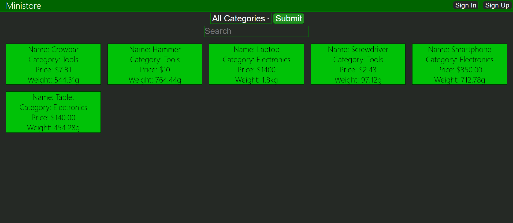
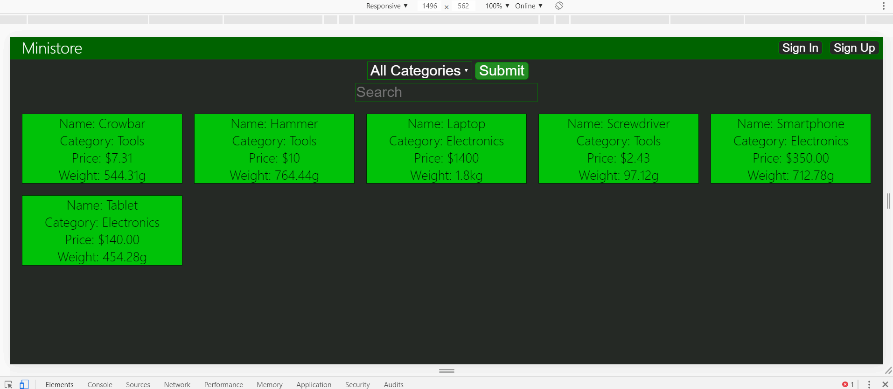
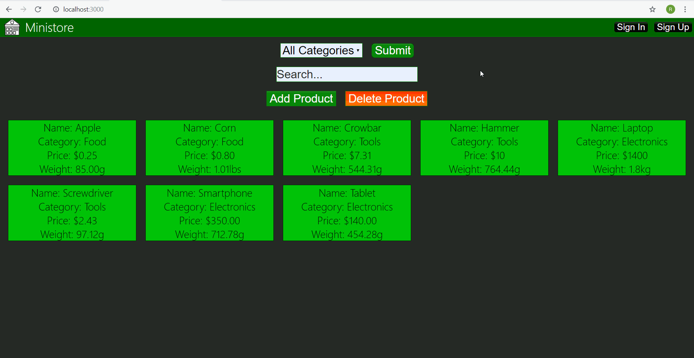
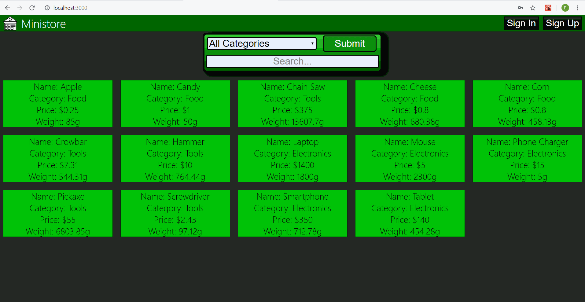
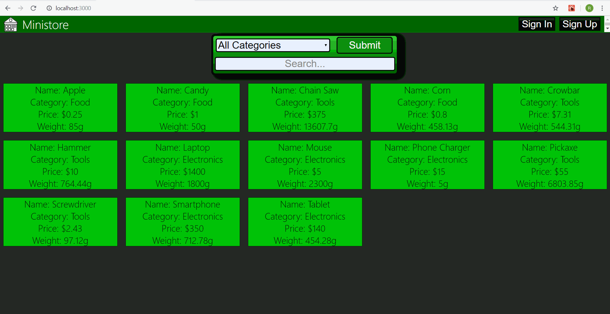

## Project Overview
This project is a psuedo E-Commerce website I am made with Java's Spring framework and MySQL on the backend and React on the frontend.

### Features that have been added:  
-Responsive product display  
-Filtered product display by category (Ex: products that are listed as tools) and search bar (Ex: products that start with "ham")  
-Login and sign up for accounts  
-Ability to add and delete products 
-Ability to add categories to database  
-Ability to remove categories if they are no products in the specified category  
-User privileges. There are 3 privileges (Customer, Staff, Master). Customers are users that have signed up for an account and can buy products. Staff members can add/delete products in the inventory database. The Master(me) can also add/delete categories and choose which accounts are permitted Staff privileges.  
-A fake money system (Customers start with $0 but can add money to their wallet just by entering an amount)  
-Ability for users to purchase products (Only their wallets get updated)  

### Product Filtration Demo  
This is a demo GIF that shows how the site currently looks like and highlights the filtration functionality. First it shows filtering by category, then by using the search bar, then both.  

### Responsiveness Demo  
This is a demo GIF that highlights the responsiveness of the site. The main thing to observe is how the product grid adapts to the width of the device. This is not exactly how it would be seen on on smaller devices because the fullscreen of my device was not being used but it gives an idea.  

### Login/Sign Up Demo  
This is a demo GIF that shows the login and sign up functionality of the site. It deals with two accounts ryan97(mine) and Customer(password is Customer), the former is already an account while the latter needs to sign up. The demo shows the following:
1) Me logging in then logging out, then me entering the wrong password
2) Customer trying to log in 
3) Customer trying to sign up with my username then successfully signing up
6) Customer refreshing the page
7) Customer logging out then logging back in  

### Product Adding Demo  
This is a demo GIF that shows what the process of adding products to the database looks like. First it shows that the cancel button on the form works as well as form validation. Finally after the form has been validated, you can see that a cheese product has been added to the inventory.  

### Product Deletion Demo  
This is a demo GIF that shows what the process of deleting products from the database looks like. At first a product is added to be deleted later. Then it shows what happens when you click on the delete button and hover over a product. Then it shows how to exit out of delete mode and re-enter (I clicked on the Delete Me product to show that no delete will occur after exiting delete mode). Finally it shows the result of a deletion and what happens when you try to delete a product again.

### Category Adding and Deletion Demo  
This is a demo GIF that shows the process of creating and deleting a category and what happens with invalid inputs such as adding a category twice.  

### User Privledges Demo  
This is a demo GIF that the user privledge functionality. At first the user Employee has STAFF privledges but then the Master user changes their privledges to CUSTOMER and then restores it back.  

### Purchasing and Depositing Demo  
This is a demo GIF that shows the process of buying a product from a customer's perspective. At first the user is not logged in, then the user must deposit some funds to purchase a product.  

### Security Demo  
This is a demo GIF that shows what happens when someone manipulates the front end to change the database using the UI that is supposed to be exclusive to privledged users. Note that when I am at the user list page, I modify the access token by one character simulating a user impersonating the Master user.  

